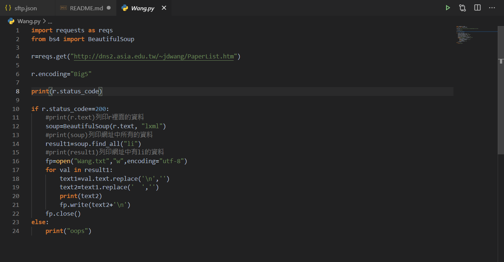

# 109021089-ciyan

## <font color="#FF" style="background-color:#FFCF78"><font size=6 face="HYMyeongJo-Extra">3/26 進階課程 + HomeWork</font></font>

## <font color="#FFF0F5" style="background-color:#B0C4DE"><font size=5 face="HYMyeongJo-Extra">FIRST CLASS</font></font>

<font face="標楷體">在自己的專案中，<font color="#FF" style="background-color:#FFCF78">創建新的HTML檔案</font>，尋找亞洲大學資電學院一位老師的網頁著作，複製他的程式碼並貼上自己剛剛建立的檔案中。</font>

<table border="0" cellpadding="0" cellspacing="0" style="width: 100%;"><tbody><tr>
<td></td>
<td></td>
</tr></tbody></table>
<table border="0" cellpadding="0" cellspacing="0" style="width: 100%;"><tbody><tr>
<td></td>
<td></td>
</tr></tbody></table>
<table border="0" cellpadding="0" cellspacing="0" style="width: 100%;"><tbody><tr>
<td></td>
<td></td>
</tr></tbody></table>

## <font color="#FFF0F5" style="background-color:#B0C4DE"><font size=5 face="HYMyeongJo-Extra">SECOND CLASS</font></font>

<font face="標楷體">需要在終端機中<font color="#FF" style="background-color:#FFCF78">下載「requests、BeautifulSoup4、lxml」</font>才可以執行以下的程式。</font>

- 步驟:
  1、在Terminal中輸入「python pip -m install requests」 
  2、在Terminal中輸入「python pip -m install BeautifulSoup4」
  3、在Terminal中輸入「python pip -m install lxml」
<br>
- 如果輸入的網址中是存在的話，就會列印出200；如果輸入的網址是不存在的話，就會列印出404。

```Python
import requests as reqs

r=reqs.get("http://210.70.80.21/~bs109021089/Publication.html")

print(r.status_code)
```

- 如果網址是存在的話，就會列印出網址裡所有的文字。

```Python
import requests as reqs
from bs4 import BeautifulSoup

r=reqs.get("http://210.70.80.21/~bs109021089/Publication.html")

r.encoding="utf-8"

print(r.status_code)

if r.status_code==200:
    print(r.text)
else:
    print("oops")
```

- 如果網址是存在的話，可以自行選擇需要網址碼的部分，並且列印出來。

```Python
import requests as reqs
from bs4 import BeautifulSoup

r=reqs.get("http://210.70.80.21/~bs109021089/Publication.html")

r.encoding="utf-8"

print(r.status_code)

if r.status_code==200:
    soup=BeautifulSoup(r.text, "lxml")
    result1=soup.find_all("li")
    print(result1)
else:
    print("oops")
```

## <font color="#FFF0F5" style="background-color:#B0C4DE"><font size=5 face="HYMyeongJo-Extra">THIRD CLASS</font></font>

<font face="標楷體">這堂課中，我們自行選擇需要網址碼的部分，<font color="#FF" style="background-color:#FFCF78">在直接列印的時候，同一時間由電腦創建一個文檔。</font></font>

```Python
import requests as reqs
from bs4 import BeautifulSoup

r=reqs.get("http://210.70.80.21/~bs109021089/Publication.html")

r.encoding="utf-8"

print(r.status_code)

if r.status_code==200:
    soup=BeautifulSoup(r.text, "lxml")
    result1=soup.find_all("li")
    fp=open("out1.txt","w",encoding="utf-8")
    for val in result1:
        text1=val.text.replace('\n','')
        text2=text1.replace('  ','')
        print(text2)
        fp.write(text2+'\n')   
    fp.close()
else:
    print("oops")
```

## <font color="#FFF0F5" style="background-color:#B0C4DE"><font size=5 face="HYMyeongJo-Extra">Homework</font></font>

<font face="標楷體">用Python抓蟲，去抓王經篤或者黃明祥老師的網頁資料並將資料寫入資料檔。將操作過程寫成筆記。</font>

- <font face="標楷體">Wang(py)</font>
[109021089-CIYAN](Wang.py)



- <font face="標楷體">Wang(txt)</font>
[109021089-CIYAN](Wang.txt)

